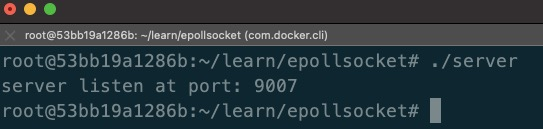

# 创建并bind Socket

现代化设置本机端口，可以使用地址信息获取方法:`int(*getaddrinfo)(const char *,const char *,const struct addrinfo *hints,struct addrinfo **result)`, 其需要一个预设入参`hints`和被设置结果参数`result`:

```cpp
struct addrinfo hints, *result, *p;
// 默认先把hints置空
memset(&hints, '\0', sizeof(hints));
hints.ai_family = AF_UNSPEC;        // 不指定IPv4还是IPv6，由程序自定
hints.ai_socktype = SOCK_STREAM;    // 指定使用TCP
hints.ai_flags = AI_PASSIVE;        // 让程序为我设置地址、端口等信息
if ((status = getaddrinfo(NULL, port, &hints, &result)) != 0) {
    perror("getaddrinfo");
    return -1;
}
```
以上即获取到result地址信息，但是可能会有多个信息存储在链表`result->ai_next上`，我这里选择第一个绑定成功者:

```cpp
for (p = result; p != NULL; p = p->ai_next) {
    if ((sfd = socket(p->ai_family, p->ai_socktype, p->ai_protocol)) == -1) {
        perror("server: socket");
        continue;
    }
    if ((status = setsockopt(sfd, SOL_SOCKET, SO_REUSEADDR, &yes, sizeof(yes))) != 0) {
        perror("setsockopt");
        return -1;
    }
    if ((status = bind(sfd, p->ai_addr, p->ai_addrlen)) != 0) {
        perror("server: bind");
        continue;
    }
    break;
}
// 如果未绑定成功，则报系统错误
if (p == NULL) {
    perror("socket null");
    return -2;
}
// 由于result为堆数据，最后必须释放
freeaddrinfo(result);
return sfd;
```

以上为获得已绑定可用的Socket句柄`sfd`, 接下来我们来使用该信息，并正式启用监听`listen`:

```cpp
char* port = "9007";

int sfd, status;
if ((sfd = create_and_bindsocket(port)) < 0) {
    return 1;
}
if ((status = listen(sfd, SOMAXCONN)) != 0) {
    perror("server: listen");
    return 1;
}
printf("server listen at port: %s\n", port);
return 0;
```


